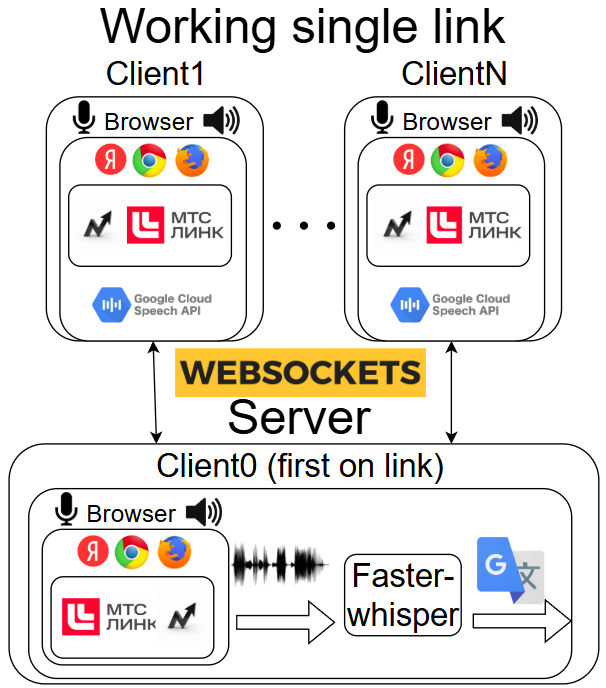

# Система Хак: Нижний Новгород
# Кейс от МТС Линк: Доступные интернет-конференции для людей с ограниченными возможностями
<a name="readme-top"></a>
<p align="center">  

</p>
  <p align="center">
    <!--<h1 align="center">Strelka</h1>-->
  </p>
  <p align="center">
    <p></p>
    <!-- <p><strong>Доступные интернет-конференции для людей с ограниченными возможностями.</strong></p> -->

  </p>
</div>


### Разработан в рамках [Система Хак: Нижний Новгород](https://truetecharena.ru/contests/system-hack-nn#/) командой "Strelka".
 

**Содержание:**
- [Базовый репозиторий](#title1)
- [Основные изменения](#title2)
- [Схема решения](#title3)
- [Инструкция по установке](#title4)

# Whisper Live: Forked and Enhanced
# <h1 align="start"><a id="title1">Базовый репозиторий</a></h1>  

Это форк оригинального решения с сервисом и браузерным расширением для записи, транскрипции и перевода аудио в реальном времени. Мы внесли изменения, чтобы оптимизировать нагрузку на сервер и улучшить пользовательский опыт.

## <h2 align="start"><a id="title2">Основные изменения</a></h2> 

1. **Реорганизация серверной архитектуры**
   Перестроена логика так, что вместо выделения отдельной модели на каждого пользователя используется одна общая модель для конференции. Это позволяет существенно снизить нагрузку на сервер.

2. **Улучшение UI/UX расширения**
   Обновлён внешний вид и логика работы браузерного расширения для более интуитивного управления и удобного доступа к функциям сервиса.

3. **Добавление Text-to-Speech (TTS)**
   Добавлена функция озвучивания транскрипций с использованием встроенных браузерных возможностей. В дальнейших планах – интеграция кастомного TTS-решения.

4. **Расширенный функционал перевода**
   Помимо перевода на английский, проект поддерживает перевод на дополнительные языки, что значительно расширяет возможности использования.

5. **Саммаризация транскриптов**
   Реализована предварительная версия функции саммаризации для получения кратких обзоров длинных транскрипций.

# <h1 align="start"><a id="title3">Схема решения</a></h1> 

<a name="readme-top"></a>
<p align="center">  

</p>
  <p align="center">
    <!--<h1 align="center">Strelka</h1>-->
  </p>
  <p align="center">
    <p></p>
    <!-- <p><strong>Доступные интернет-конференции для людей с ограниченными возможностями.</strong></p> -->

  </p>
</div>


# <h1 align="start"><a id="title4">Как запустить</a></h1>  

## !!!После запуска контейнера подождать для начала работы сервиса!!!

## Запуск через Docker

### Контейнер на базе CPU

Для сборки контейнера с использованием Dockerfile для CPU выполните команды:

```bash
docker build -f docker/Dockerfile.cpu -t whisperlive:cpu .
docker run -p 9090:9090 whisperlive:cpu
```
#### Системные требования (на одну конференцию или видео)
В зависимости от выбранной модели от 2 гб до 8 гб оперативной памяти + оперативка на поддержку работы сервиса (+-10 гб) 


### Контейнер с поддержкой GPU (рекомендуется)

Для сборки контейнера с использованием Dockerfile для GPU выполните команды:

```bash
docker build -f docker/Dockerfile.gpu -t whisperlive:gpu .
docker run -p 9090:9090 --runtime=nvidia --gpus all whisperlive:gpu
```
#### Системные требования (на одну конференцию или видео)

В зависимости от выбранной модели от 2 гб (tiny) до 8 гб (large-v3) CUDA GPU памяти + оперативка на поддержку работы сервиса (+-10 гб)

### Сервер

Следуйте инструкциям в [README_WhisperLive.md](README_WhisperLive.md) для запуска сервера с выбранными backend-решениями. Пример запуска:

```bash
python3 run_server.py --port 9090 --backend faster_whisper --omp_num_threads 4
```

### Браузерное расширение

1. Установите расширение для Chrome из папки Audio-Transcription-Chrome.
2. Запустите сервер.
3. Используйте расширение для начала захвата и транскрипции аудио в режиме реального времени нажав на кнопку Start Capture  расширении.
